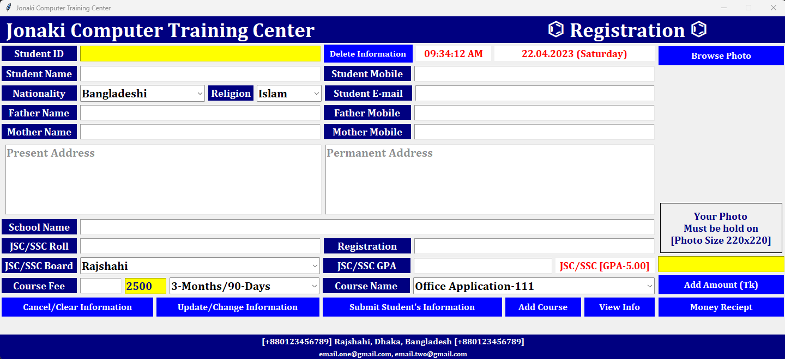
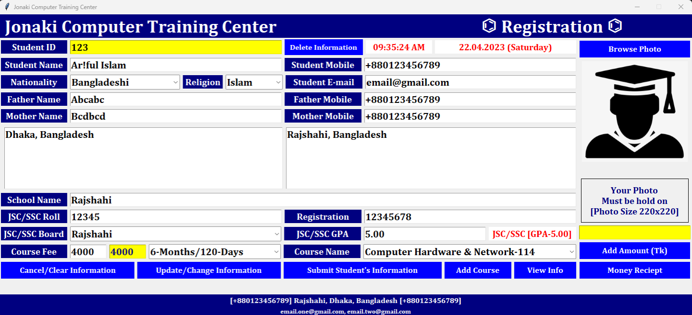
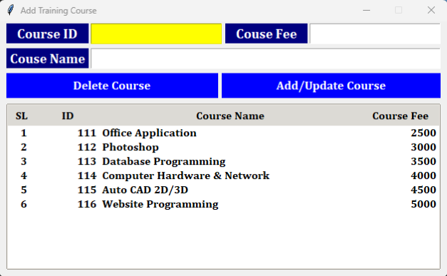
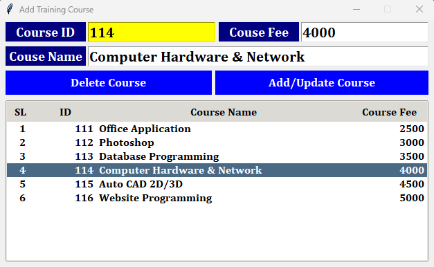
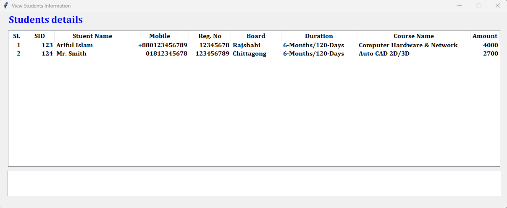
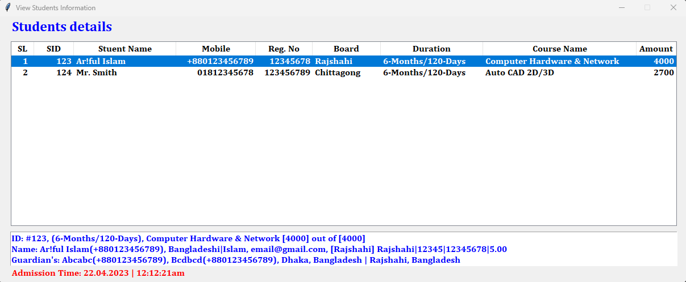
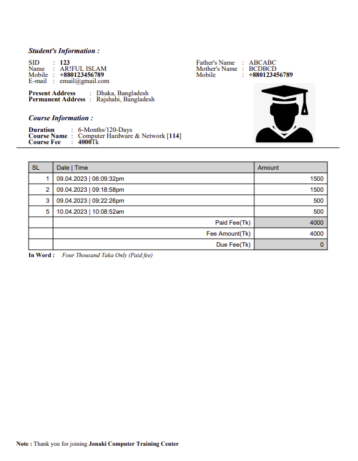

# Computer Training Registration System

### **A Python-based _computer training registration system_ using Tkinter GUI and SQLite database**

Tkinter is a Python binding to the Tk GUI toolkit. It is the standard Python interface to the Tk GUI toolkit, and is Python's defacto standard GUI.


## Task Description

A project to build a Python-based computer training registration system to store students information. Here add/update/delete training course info, add/update/delete students information with student photo, payment course fee into database to give information. Then will create and store PDF file as student id number into date wise folder. You can show and print money reciept as [PDF](https://en.wikipedia.org/wiki/PDF) using [ReportLab](https://www.reportlab.com/).


## Task Requirments
this project is developed using all new os, software and tools.

* **Operating System :** Windows11, Kali Linux2025.2
* **Software :** Python3.13, Visual Studio Code
* **GUI Library :** Tkinter (`Default`) 


## Installation

First [Download](https://www.python.org/downloads/), install and configure [Python](https://www.python.org/doc/). Then use the package manager [pip](https://pip.pypa.io/en/stable/) to install on.

* Windows installation
* Kali linux installation
* Mac installation


## Notes

The `requirements.txt` file, lists of all the Python libraries that my "**_computer training registration system_**" depends on and installs those packages from the file:

```bash
pip install -r requirements.txt
# or
sudo pip install -r requirements.txt
```


## Sreenshots
Here are some screenshots of the `Computer Training Registration System` project:

**Application**<br/>
<br/>
**View Information**<br/>
<br/>
**Add Course**<br/>
<br/>
**View Course**<br/>
<br/>
**Student Information**<br/>
<br/>
**View Student Information**<br/>
<br/>
**Invoice**<br/>
<br/>


## Contributing

Contributions, suggestions, and feedback are always welcome!<br/>
To contribute:

1. Fork the repository
1. Create a new branch (`feature/new-feature`)
1. Commit your changes
1. Push and submit a Pull Request

💬 You can also open an issue if you’d like to discuss a feature or report a bug.


## For more or connect with me

<p align='center'>
  <a href="https://github.com/iamx-ariful-islam"></a>&nbsp;&nbsp;
  <a href="https://bd.linkedin.com/in/iamx-ariful-islam"></a>&nbsp;&nbsp;
  <a href="https://x.com/mx_ariful_islam"></a>&nbsp;&nbsp;
  <a href="https://www.facebook.com/iamx.ariful.islam/"></a>
</p>


## License

The [MIT](https://choosealicense.com/licenses/mit/) License (MIT)


## Thank You for Visiting!

> “Good design is about making things simple yet significant”  
> — *Md. Ariful Islam*